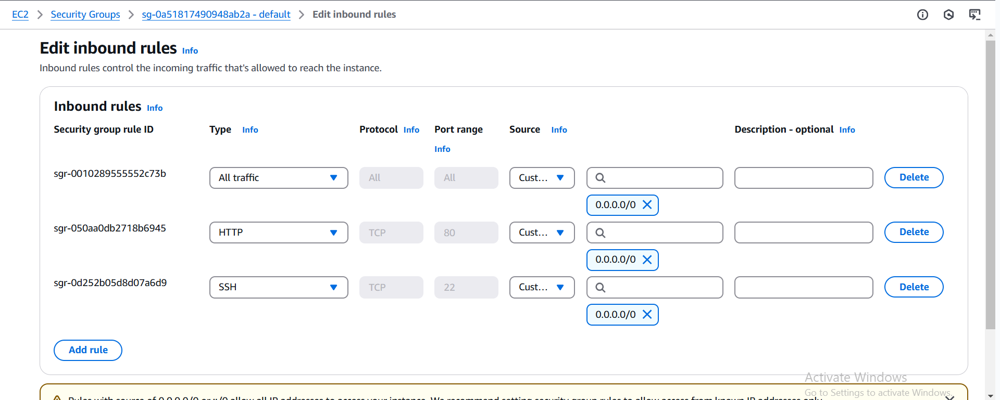

## USING GITBASH TO SSH INTO YOUR EC2 INSTANCE SETUP.

* To connect to my EC2 instance, I was required to SSH into it. I had challenges doing this because I could not suucessfully convert my key pair from .pem to .ppk and use putty SSH server, so I followed 
the alternative steps below;

    - Download git and install the package
    - Add Gitbash as a different profile on windows terminal
    - Add the exe file to the file path on windows terminal
    - cd to the actual location of the key pair file. `cd /c/users/DELL/downloads`
    - From your console, edit the inbound rules for the security group my instance is running on. Permit inbound HTTP traffic on port 80 from anywhere i.e 0.0.0.0/0
    - Again from your console, add a new inbound rule to allow SSH clients to connect. Permit/select inbound SSH traffic on port 22 from anywhere i.e 0.0.0.0/0. Your set up should look something like this when you are done 
    - chmod on the key pair file. `sudo chmod 400 <private-key-name>.pem`. This is to ensure that your key is not publicly visible.
    - Connect to the instance by running the command: `ssh -i <private-key-name>.pem ubuntu@<Public-IP-address>`. Keep in mind that your public IPv4 address changes every time you restart your instance. Also insert your pem key and public ipv4 address in the open anchor brackets.

## ALTERNATE WAY TO RETRIEVE YOUR PUBLIC IP ADDRESS 

* Another way to retrieve your Public IP address, other than to check it in AWS Web console, is to use following command:

>`curl -s http://169.254.169.254/latest/meta-data/public-ipv4 `

>`TOKEN=curl -X PUT "http://169.254.169.254/latest/api/token" -H "X-aws-ec2-metadata-token-ttl-seconds: 21600"` 

>`curl -H "X-aws-ec2-metadata-token: $TOKEN" -v http://169.254.169.254/latest/meta-data/public-ipv4`

* See reference for retrieving your AWS instance [here](https://docs.aws.amazon.com/AWSEC2/latest/UserGuide/instancedata-data-retrieval.html)

## CLONE GIT TO VSCODE TO ALLOW US PUSH COMMITS FROM VS CODE

* Open git terminal.
* Create a directory and name it to what you want it to be.
* cd into the directory where you want to set up your repository.
* Clone your git repository. Copy the url of your repository then run the command  `git clone https://github.com/4eyedZedd/DEVOPS_PROJECTS.git`
* When you update your code or changes to your file, run the following series of commands to push your updates as commits to your repository
    * `git add .`
    * `git commit -m " "`. Insert a clear commit message, one that helps  you remmber the exact change/update you made.
    * `git push`